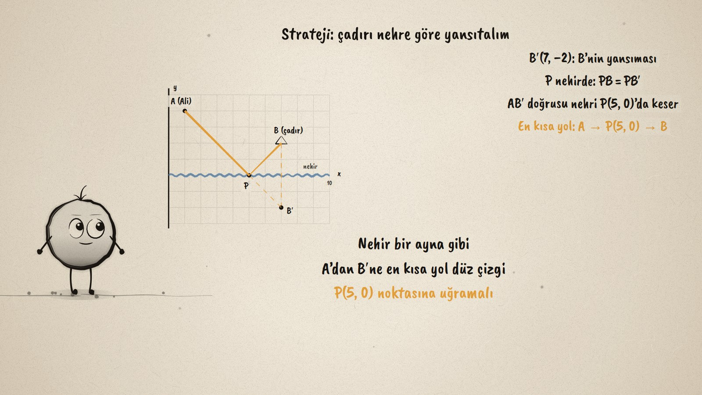
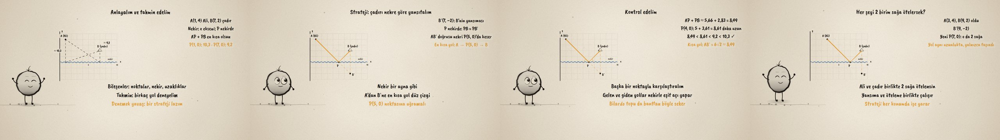

# En Kısa Yol · The Shortest Path

**▶ Tarayıcıda izleyin / Watch in the browser:** https://hakanatas.github.io/en-kisa-yol/ 
**⬇ MP4 + altyazılar / MP4 + subtitles:** [Releases](https://github.com/hakanatas/en-kisa-yol/releases) 
**✎ Kullanılan istem / The prompt behind it:** [PROMPT.md](PROMPT.md) 
**🎞 Bütün filmler / All films:** [Nokta'nın Filmleri](https://hakanatas.github.io/nokta-filmleri/?sinif=8)

> **TR —** 8. sınıf matematik "Dönüşüm" temasındaki MAT.8.5.3 öğrenme çıktısı için hazırlanmış, tamamen JavaScript ile çizilen 92 saniyelik mürekkep animasyonu. Ali A(1, 4) noktasından nehirden (x ekseni) su alıp B(7, 2) noktasındaki çadıra gidecek: nehrin neresine uğrarsa yol en kısa olur? Önce bileşenler belirleniyor ve iki deneme yolu ölçülüyor (yaklaşık 10,3 ve 9,2 birim). Strateji: çadır nehre göre yansıtılıyor, B′(7, −2); nehirdeki her P için PB = PB′ olduğundan en kısa yol A’dan B′ne çizilen doğru ve bu doğru nehri P(5, 0) noktasında kesiyor. Sonuç başka bir noktayla kontrol ediliyor (8,49 < 8,61), kısa yol olarak AB′ = 6√2 görülüyor. Son olarak Ali ve çadır birlikte 2 birim sağa ötelenince P’nin de 2 birim sağa gittiği ve stratejinin genellendiği gösteriliyor. Altyazılar Türkçe, İngilizce ya da ikisi birlikte seçilebilir.

A 92-second ink animation for **8th-grade maths**. Nokta, the ink character from [The Learning Ink](https://github.com/hakanatas/the-learning-ink), is the guide again. The whole scene is built from four points that move with one variable (`sh` in `scenes/scene1.js`): when the problem is translated 2 units to the right, A, B, B′ and P all move together, so the generalisation is shown by the same drawing rather than a new one.

## Learning outcome

MEB, Türkiye Yüzyılı Maarif Modeli, Ortaokul Matematik, 8th grade, "Dönüşüm" theme:

**MAT.8.5.3. Öteleme ve yansıma dönüşümlerini içeren problemleri çözebilme**
- a) Öteleme ve yansıma dönüşümlerine ilişkin problemlerde ilgili matematiksel bileşenleri (eşlik, uzaklık, diklik, paralellik, koordinatlar gibi ) belirler.
- b) Matematiksel bileşenler arasındaki ilişkileri belirler.
- c) Problem bağlamındaki temsilleri farklı temsillere dönüştürür.
- ç) Matematiksel temsillere dönüştürdüğü problemi kendi ifadeleri ile açıklar.
- d) Öteleme ve yansıma dönüşümlerini içeren problemlerin sonucuna ilişkin tahminde bulunur ve işlemleri gerçekleştirmek için stratejiler geliştirir.
- e) Belirlenen stratejileri çözüm için uygular.
- f) Çözüm yollarını kontrol eder ve çözüme ulaştırmayan stratejiyi değiştirir.
- g) Problemin çözümü için kullandığı veya geliştirdiği stratejileri gözden geçirerek kısa yolları değerlendirir.
- ğ) Kullandığı strateji veya stratejileri farklı problemlerin çözümlerine geneller.
- h) Genellemenin geçerliliğini matematiksel örneklerle değerlendirir.

## Scenes

| # | Time | Scene | What happens | Outcome |
|---|---|---|---|---|
| 1 | 0–10 s | Nehir | Where should Ali touch the river on the way to the tent? | a |
| 2 | 10–28 s | Anla | The points, the river as the x-axis, two guessed paths. | a, b, c, ç, d |
| 3 | 28–46 s | Yansıt | Reflect B: B′(7, −2); the line AB′ meets the river at P(5, 0). | d, e |
| 4 | 46–64 s | Kontrol | 8.49 against 8.61, 9.2 and 10.3; shortcut AB′ = 6√2; equal angles. | f, g |
| 5 | 64–80 s | Ötele | Everything 2 to the right: P moves to (7, 0). | ğ, h |
| 6 | 80–92 s | Özet | Components, estimate, strategy, check. | a–h |

## Running it

- **Preview:** double-click `index.html` (it works offline).
- **MP4:** run `npm install` once, then `npm run export -- --format=horizontal --captions=tr`.
- **Subtitles and narration:** `npm run srt` writes `out/captions_*.srt` and `narration_notes.txt`.
- **Editing:**
  - Caption text, timings and narration notes: `captions.js`
  - Everything on screen is drawn by `LI.world(t)` in `scenes/scene1.js` (the grid, the river, the points, the paths, the words); the other scenes only set the camera.
  - Nokta's poses: `src/draw/film.js`; layout for 16:9 and 9:16: `src/draw/kd.js`

It uses the same engine as The Learning Ink: `renderFrame(t)` as a pure function of time, seeded randomness, and frame-by-frame export.
